# 企业级皮肤大数据管理与智能分析平台 数据库 ERD v1

## 1. 设计目标

本 ERD 用于承接：

- [PRD v3.1](D:\CIDWeb\docs\skin_analytics_platform_prd_v3_1.md)
- [技术架构与实现方案 v1](D:\CIDWeb\docs\skin_analytics_technical_architecture_v1.md)

目标：

- 支撑多租户、多品牌、多版本
- 支撑主键映射与多源整合
- 支撑分析任务、执行快照、派生变量发布
- 支撑高敏导出审批和审计

---

## 2. 领域划分

### 2.1 身份与权限域

- `tenant`
- `organization_user`
- `role`
- `permission`
- `role_permission`
- `project`
- `project_member`

### 2.2 品牌配置与版本域

- `brand`
- `brand_config_version`
- `metric_catalog`
- `metric_catalog_version`
- `metric_alias`
- `questionnaire_template`
- `questionnaire_template_version`
- `questionnaire_question`
- `questionnaire_option`
- `questionnaire_campaign`
- `questionnaire_response`
- `questionnaire_response_item`
- `questionnaire_scoring_result`
- `version_bundle`
- `project_brand_binding`

### 2.3 数据资产域

- `dataset`
- `import_batch`
- `dataset_version`
- `dataset_version_lineage`
- `subject`
- `subject_identifier`
- `visit_record`
- `variable_meta`
- `derived_variable_set`

### 2.4 分析与结果域

- `cohort_rule`
- `analysis_template`
- `analysis_job`
- `execution_manifest`
- `analysis_result`
- `chart_config`

### 2.5 导出审批域

- `export_package`
- `export_approval_request`

### 2.6 审计域

- `audit_log`

---

## 3. Mermaid ER 图

```mermaid
erDiagram
    TENANT ||--o{ ORGANIZATION_USER : has
    TENANT ||--o{ PROJECT : owns
    TENANT ||--o{ BRAND : owns

    ROLE ||--o{ ROLE_PERMISSION : grants
    PERMISSION ||--o{ ROLE_PERMISSION : includes
    PROJECT ||--o{ PROJECT_MEMBER : has
    ORGANIZATION_USER ||--o{ PROJECT_MEMBER : joins
    ROLE ||--o{ PROJECT_MEMBER : assigned

    BRAND ||--o{ BRAND_CONFIG_VERSION : versions
    METRIC_CATALOG ||--o{ METRIC_CATALOG_VERSION : versions
    METRIC_CATALOG_VERSION ||--o{ METRIC_ALIAS : maps
    QUESTIONNAIRE_TEMPLATE ||--o{ QUESTIONNAIRE_TEMPLATE_VERSION : versions
    QUESTIONNAIRE_TEMPLATE_VERSION ||--o{ QUESTIONNAIRE_QUESTION : contains
    QUESTIONNAIRE_QUESTION ||--o{ QUESTIONNAIRE_OPTION : has
    QUESTIONNAIRE_TEMPLATE_VERSION ||--o{ QUESTIONNAIRE_CAMPAIGN : publishes
    QUESTIONNAIRE_CAMPAIGN ||--o{ QUESTIONNAIRE_RESPONSE : collects
    QUESTIONNAIRE_RESPONSE ||--o{ QUESTIONNAIRE_RESPONSE_ITEM : answers
    QUESTIONNAIRE_RESPONSE ||--o{ QUESTIONNAIRE_SCORING_RESULT : scores

    PROJECT ||--o{ VERSION_BUNDLE : binds
    BRAND ||--o{ VERSION_BUNDLE : scoped_to
    BRAND_CONFIG_VERSION ||--o{ VERSION_BUNDLE : includes
    METRIC_CATALOG_VERSION ||--o{ VERSION_BUNDLE : includes
    QUESTIONNAIRE_TEMPLATE_VERSION ||--o{ VERSION_BUNDLE : includes
    PROJECT ||--o{ PROJECT_BRAND_BINDING : enables
    BRAND ||--o{ PROJECT_BRAND_BINDING : enabled
    VERSION_BUNDLE ||--o{ PROJECT_BRAND_BINDING : defaults

    PROJECT ||--o{ DATASET : owns
    BRAND ||--o{ DATASET : scoped_to
    DATASET ||--o{ IMPORT_BATCH : receives
    DATASET ||--o{ DATASET_VERSION : versions
    DATASET_VERSION ||--o{ DATASET_VERSION_LINEAGE : from_version
    DATASET_VERSION ||--o{ DATASET_VERSION_LINEAGE : to_version
    IMPORT_BATCH ||--o{ DATASET_VERSION : source_for

    PROJECT ||--o{ SUBJECT : owns
    BRAND ||--o{ SUBJECT : scoped_to
    SUBJECT ||--o{ SUBJECT_IDENTIFIER : has
    SUBJECT ||--o{ VISIT_RECORD : has
    SUBJECT ||--o{ QUESTIONNAIRE_RESPONSE : submits
    DATASET_VERSION ||--o{ VISIT_RECORD : contains
    DATASET_VERSION ||--o{ VARIABLE_META : defines
    DERIVED_VARIABLE_SET ||--o{ VARIABLE_META : sources

    PROJECT ||--o{ COHORT_RULE : owns
    PROJECT ||--o{ ANALYSIS_TEMPLATE : owns
    PROJECT ||--o{ ANALYSIS_JOB : has
    BRAND ||--o{ ANALYSIS_JOB : scoped_to
    VERSION_BUNDLE ||--o{ ANALYSIS_JOB : uses
    DATASET_VERSION ||--o{ ANALYSIS_JOB : uses
    COHORT_RULE ||--o{ ANALYSIS_JOB : optional
    ANALYSIS_TEMPLATE ||--o{ ANALYSIS_JOB : optional

    ANALYSIS_JOB ||--|| EXECUTION_MANIFEST : has
    ANALYSIS_JOB ||--o{ ANALYSIS_RESULT : produces
    ANALYSIS_JOB ||--o{ CHART_CONFIG : produces
    ANALYSIS_JOB ||--o{ DERIVED_VARIABLE_SET : produces
    DERIVED_VARIABLE_SET ||--o| DATASET_VERSION : publishes_to
    ANALYSIS_JOB ||--o{ EXPORT_PACKAGE : exports
    EXPORT_PACKAGE ||--o{ EXPORT_APPROVAL_REQUEST : requests

    TENANT ||--o{ AUDIT_LOG : logs
    PROJECT ||--o{ AUDIT_LOG : logs
```

---

## 4. 表设计

### 4.1 `tenant`

用途：

- 平台最小隔离单元

关键字段：

- `tenant_id` PK
- `tenant_code` UNIQUE
- `tenant_name`
- `status`
- `data_isolation_mode`
- `created_at`
- `updated_at`

### 4.2 `organization_user`

关键字段：

- `user_id` PK
- `tenant_id` FK
- `email`
- `phone`
- `display_name`
- `status`
- `is_super_admin`
- `created_at`

### 4.3 `role`

关键字段：

- `role_id` PK
- `tenant_id` nullable FK
- `role_name`
- `role_scope`
- `created_at`

### 4.4 `permission`

关键字段：

- `permission_id` PK
- `permission_code` UNIQUE
- `permission_name`

### 4.5 `role_permission`

关键字段：

- `role_permission_id` PK
- `role_id` FK
- `permission_id` FK

### 4.6 `project`

关键字段：

- `project_id` PK
- `tenant_id` FK
- `project_code`
- `project_name`
- `project_type`
- `import_mode_default`
- `status`
- `created_by`
- `created_at`

### 4.7 `project_member`

关键字段：

- `project_member_id` PK
- `project_id` FK
- `user_id` FK
- `role_id` FK
- `brand_scope_mode`
- `created_at`

### 4.8 `brand`

关键字段：

- `brand_id` PK
- `tenant_id` FK
- `brand_code`
- `brand_name`
- `status`
- `created_at`

### 4.9 `brand_config_version`

关键字段：

- `brand_config_version_id` PK
- `brand_id` FK
- `version_no`
- `status`
- `base_version_id` nullable FK self
- `created_by`
- `published_at`

### 4.10 `metric_catalog`

关键字段：

- `metric_catalog_id` PK
- `tenant_id` nullable FK
- `catalog_name`
- `catalog_scope`
- `created_at`

### 4.11 `metric_catalog_version`

关键字段：

- `metric_catalog_version_id` PK
- `metric_catalog_id` FK
- `version_no`
- `status`
- `base_version_id` nullable FK self
- `created_at`

### 4.12 `metric_alias`

关键字段：

- `metric_alias_id` PK
- `metric_catalog_version_id` FK
- `raw_field_name`
- `standard_metric_code`
- `instrument_family`
- `body_site`
- `variable_type`
- `is_analyzable`
- `is_default_visible`

### 4.13 `questionnaire_template`

关键字段：

- `questionnaire_template_id` PK
- `tenant_id` nullable FK
- `template_name`
- `template_scope`
- `created_at`

### 4.14 `questionnaire_template_version`

关键字段：

- `questionnaire_template_version_id` PK
- `questionnaire_template_id` FK
- `version_no`
- `status`
- `base_version_id` nullable FK self
- `scoring_rule_json`
- `logic_rule_json`
- `created_at`

### 4.15 `questionnaire_question`

关键字段：

- `question_id` PK
- `questionnaire_template_version_id` FK
- `question_code`
- `question_text`
- `question_type`
- `is_reverse_scored`
- `dimension_code`
- `display_order`

### 4.16 `questionnaire_option`

关键字段：

- `option_id` PK
- `question_id` FK
- `option_code`
- `option_label`
- `option_score`
- `display_order`

### 4.17 `version_bundle`

用途：

- 品牌维度的原子版本包

关键字段：

- `version_bundle_id` PK
- `project_id` FK
- `brand_id` FK
- `brand_config_version_id` FK
- `metric_catalog_version_id` FK
- `questionnaire_template_version_id` FK
- `is_active`
- `effective_from`
- `effective_to`
- `created_at`

### 4.18 `questionnaire_campaign`

关键字段：

- `questionnaire_campaign_id` PK
- `questionnaire_template_version_id` FK
- `project_id` FK
- `brand_id` FK
- `campaign_name`
- `campaign_type` (`internal` / `link` / `qr`)
- `campaign_token`
- `status`
- `published_at`
- `expired_at`

### 4.19 `questionnaire_response`

关键字段：

- `response_id` PK
- `questionnaire_template_version_id` FK
- `project_id` FK
- `brand_id` FK
- `dataset_version_id` nullable FK
- `subject_id` FK
- `visit_id` nullable FK
- `questionnaire_campaign_id` nullable FK
- `status`
- `submitted_at`

### 4.20 `questionnaire_response_item`

关键字段：

- `response_item_id` PK
- `response_id` FK
- `question_id` FK
- `raw_answer_json`
- `normalized_answer_json`
- `is_missing`
- `logic_warning_flag`

### 4.21 `questionnaire_scoring_result`

关键字段：

- `scoring_result_id` PK
- `response_id` FK
- `score_type`
- `score_code`
- `score_value`
- `derived_label`

### 4.22 `project_brand_binding`

关键字段：

- `project_brand_binding_id` PK
- `project_id` FK
- `brand_id` FK
- `default_version_bundle_id` FK
- `status`

### 4.23 `dataset`

关键字段：

- `dataset_id` PK
- `project_id` FK
- `brand_id` FK
- `dataset_name`
- `dataset_type`
- `status`
- `created_at`

### 4.24 `import_batch`

关键字段：

- `import_batch_id` PK
- `dataset_id` FK
- `brand_id` FK
- `version_bundle_id` FK
- `source_file_name`
- `storage_path`
- `import_mode`
- `status`
- `created_by`
- `created_at`

### 4.25 `dataset_version`

关键字段：

- `dataset_version_id` PK
- `dataset_id` FK
- `version_no`
- `parent_version_id` nullable FK self
- `source_import_batch_id` nullable FK
- `status`
- `is_derived`
- `row_count`
- `column_count`
- `dataset_hash`
- `created_by`
- `created_at`
- `published_at`

### 4.25 `dataset_version_lineage`

关键字段：

- `dataset_version_lineage_id` PK
- `from_dataset_version_id` FK
- `to_dataset_version_id` FK
- `lineage_type`
- `source_analysis_job_id` nullable FK
- `created_at`

### 4.26 `subject`

关键字段：

- `subject_id` PK
- `project_id` FK
- `brand_id` FK
- `subject_status`
- `created_at`

### 4.27 `subject_identifier`

关键字段：

- `subject_identifier_id` PK
- `subject_id` FK
- `project_id` FK
- `identifier_type`
- `identifier_value`
- `is_primary`
- `source`
- `created_by`
- `created_at`

索引建议：

- UNIQUE(`project_id`, `identifier_type`, `identifier_value`)

### 4.28 `visit_record`

关键字段：

- `visit_id` PK
- `subject_id` FK
- `dataset_version_id` FK
- `import_batch_id` FK
- `business_visit_date` nullable
- `system_batch_seq`
- `visit_label`
- `created_at`

### 4.29 `variable_meta`

关键字段：

- `variable_meta_id` PK
- `dataset_version_id` FK
- `standard_metric_code`
- `display_name`
- `raw_field_name`
- `variable_type`
- `instrument_family`
- `body_site`
- `is_derived`
- `source_derived_set_id` nullable FK

### 4.30 `derived_variable_set`

关键字段：

- `derived_variable_set_id` PK
- `analysis_job_id` FK
- `source_dataset_version_id` FK
- `target_dataset_version_id` nullable FK
- `publish_status`
- `created_by`
- `created_at`
- `published_at`

### 4.31 `cohort_rule`

关键字段：

- `cohort_rule_id` PK
- `project_id` FK
- `brand_id` FK
- `rule_name`
- `rule_json`
- `status`
- `created_by`
- `created_at`

### 4.32 `analysis_template`

关键字段：

- `analysis_template_id` PK
- `project_id` FK
- `brand_id` nullable FK
- `template_name`
- `template_scope`
- `template_json`
- `status`
- `created_at`

### 4.33 `analysis_job`

关键字段：

- `analysis_job_id` PK
- `project_id` FK
- `brand_id` FK
- `version_bundle_id` FK
- `dataset_version_id` FK
- `cohort_rule_id` nullable FK
- `analysis_template_id` nullable FK
- `analysis_type`
- `status`
- `idempotency_key`
- `submitted_by`
- `submitted_at`
- `started_at`
- `finished_at`

### 4.34 `execution_manifest`

关键字段：

- `execution_manifest_id` PK
- `analysis_job_id` FK UNIQUE
- `tenant_id`
- `project_id`
- `brand_id`
- `version_bundle_id`
- `brand_config_version_id`
- `metric_catalog_version_id`
- `questionnaire_template_version_id`
- `dataset_version_id`
- `dataset_version_hash`
- `analysis_template_version`
- `analysis_method`
- `runtime_parameters_hash`
- `engine_version`
- `library_lock`
- `random_seed`
- `timezone`
- `export_template_version`
- `manifest_hash`
- `created_at`

### 4.35 `analysis_result`

关键字段：

- `analysis_result_id` PK
- `analysis_job_id` FK
- `result_type`
- `result_summary_json`
- `result_table_path`
- `narrative_text`
- `created_at`

### 4.36 `chart_config`

关键字段：

- `chart_config_id` PK
- `analysis_job_id` FK
- `chart_type`
- `config_json`
- `preview_path`
- `export_png_path`
- `export_svg_path`

### 4.37 `export_package`

关键字段：

- `export_package_id` PK
- `analysis_job_id` FK
- `package_type`
- `package_path`
- `package_hash`
- `contains_sensitive_data`
- `status`
- `created_at`
- `expired_at`

### 4.38 `export_approval_request`

关键字段：

- `export_approval_request_id` PK
- `export_package_id` FK
- `tenant_id` FK
- `requester_user_id` FK
- `approver_user_id` nullable FK
- `approval_status`
- `reason`
- `decision_note`
- `approved_at`
- `expired_at`
- `download_limit`
- `download_count`

### 4.39 `audit_log`

关键字段：

- `audit_log_id` PK
- `tenant_id`
- `project_id` nullable
- `brand_id` nullable
- `object_type`
- `object_id`
- `action_type`
- `actor_user_id`
- `ip_address`
- `user_agent`
- `result_status`
- `detail_json`
- `created_at`

---

## 5. 版本与 Lineage 规则

### 配置版本

- `brand_config_version`
- `metric_catalog_version`
- `questionnaire_template_version`
- 通过 `version_bundle` 原子绑定

### 数据版本

- 上传、预处理、派生变量发布都生成新 `dataset_version`
- 通过 `dataset_version_lineage` 记录来源与去向

### 分析版本快照

- 每个 `analysis_job` 必须有且只有一个 `execution_manifest`
- 导出包必须附带 `manifest.json`

### 派生变量 lineage

- 派生变量先生成 `derived_variable_set`
- 发布后生成新的 `dataset_version`
- 新变量元数据回指来源派生集

---

## 6. 实施建议

- `subject_identifier` 必须带 `project_id`，便于唯一约束和快速检索
- `version_bundle` 必须作为分析上下文，而不是仅作为配置引用
- `execution_manifest.analysis_job_id` 建议唯一
- `dataset_version_lineage` 不可省略
- 高敏导出审批挂在 `export_package` 上，而不是直接挂在 `analysis_job`
