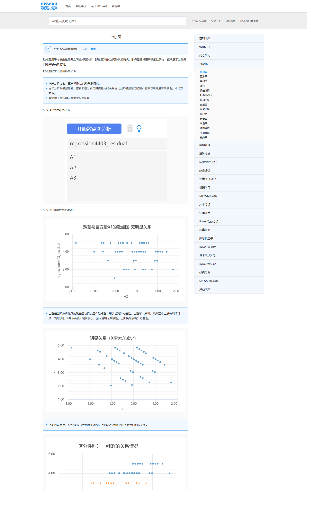
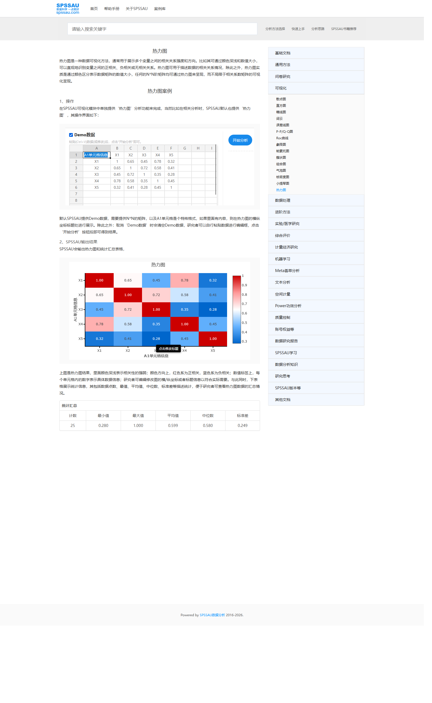
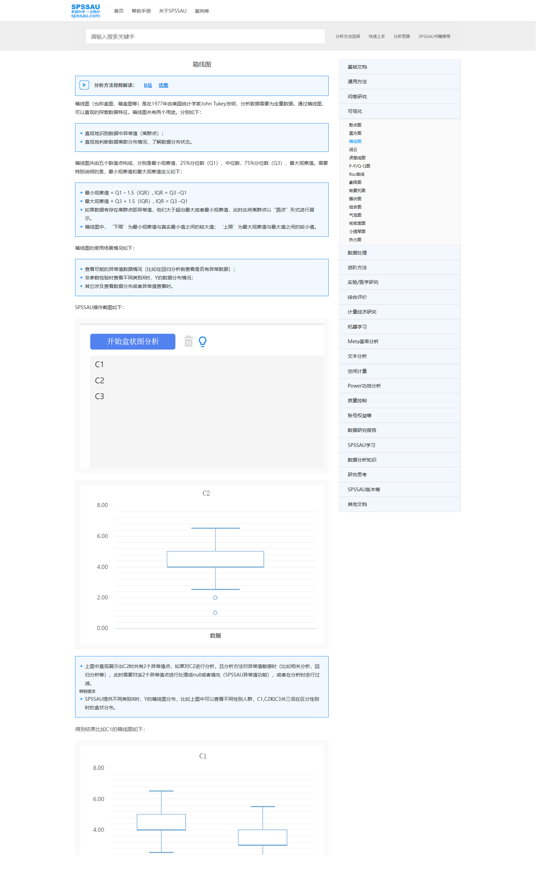
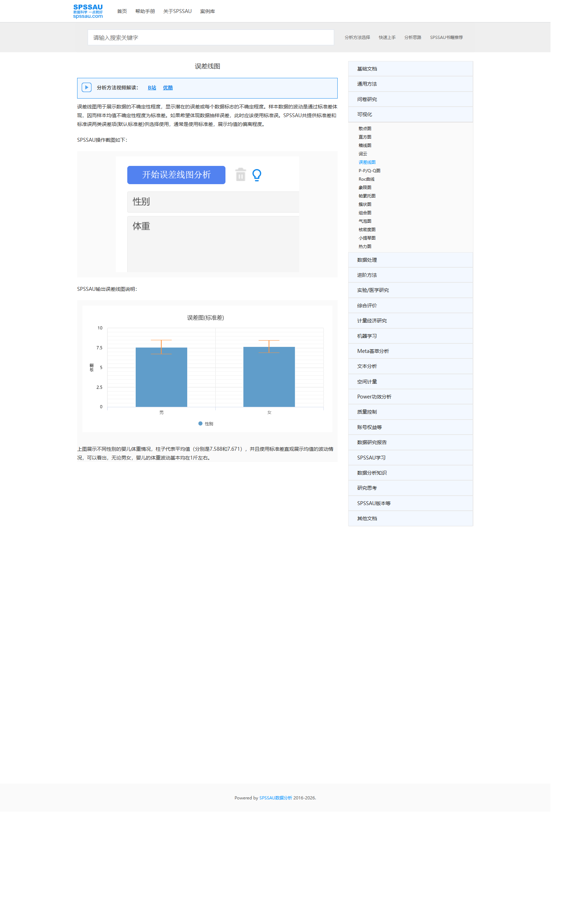
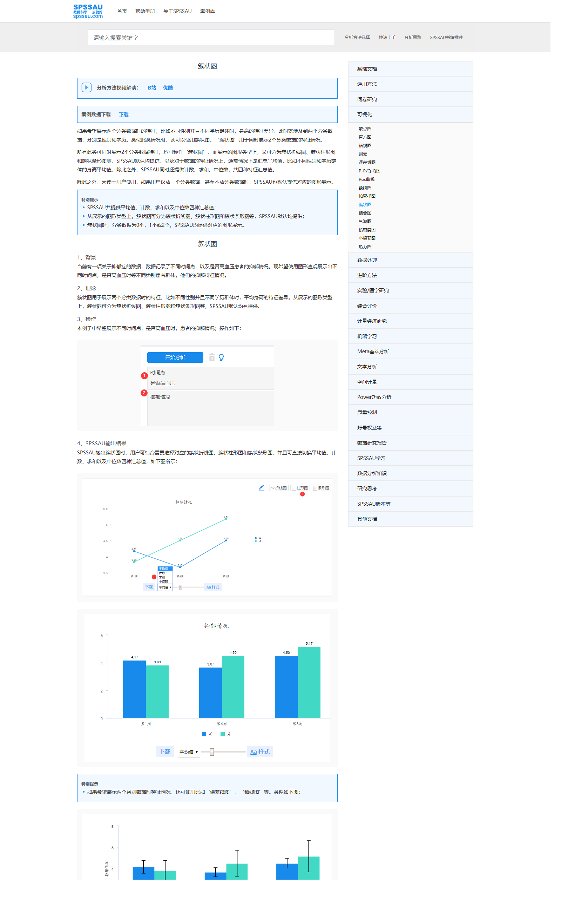
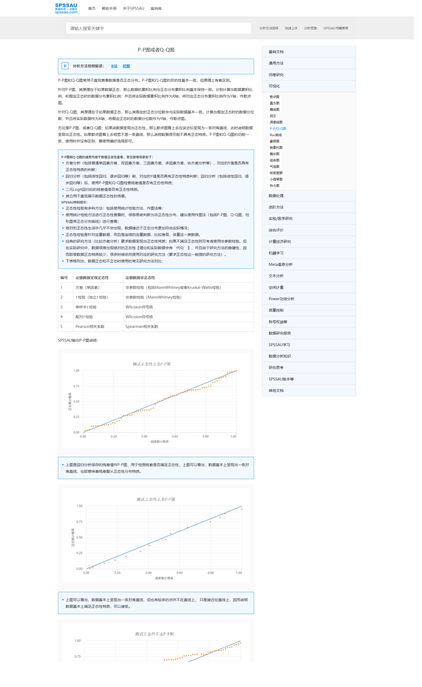

# SPSSAU 可视化界面参考附录

本附录用于给皮肤大数据平台的分析工作台、图表工作台和结果页提供外部界面参考。以下截图均来自 SPSSAU 帮助页，仅用于内部产品研究和交互借鉴。

---

## 1. 散点图

参考用途：

- 变量投放区的极简组织方式
- 单图与分组散点图的结果组织
- “先选变量，再直接出图”的低学习成本工作流

来源页：

- https://spssau.com/helps/visualization/scatter.html

截图：

建议借鉴点：

- 左侧字段树 + 中央投放区
- 结果区同时展示基础散点和分组散点
- 图下方直接给解释型提示

---

## 2. 热力图

参考用途：

- 数据预览与图表结果在同页呈现
- 热图与统计表配套展示
- 颜色图例的位置和结果阅读路径

来源页：

- https://spssau.com/helps/visualization/heatmap.html

截图：

建议借鉴点：

- 上方展示 Demo 数据结构，下方直接展示热图结果
- 热图配色和统计表组合适合你平台的相关矩阵、残差热力图、因子载荷热图

---

## 3. 箱线图

参考用途：

- 单指标箱线图与分组箱线图的连续呈现
- 结果区按“示例一、示例二”顺序展开
- 输入极简，结果直出

来源页：

- https://spssau.com/helps/visualization/box.html

截图：

建议借鉴点：

- 适合作为你平台“描述统计 -> 箱线图”模块的参考
- 但你平台应进一步增加抖动散点、显著性标注和图表样式参数区

---

## 4. 误差线图

参考用途：

- 柱形图 + 误差线的典型科研图表达
- 适合作为组间比较结果的默认图

来源页：

- https://spssau.com/helps/visualization/error.html

截图：

建议借鉴点：

- 适合你平台“均值比较 + 误差棒 + 显著性”主图方案
- 你平台应补充标准误 / 标准差 / 置信区间切换

---

## 5. 簇状图

参考用途：

- 同一页面中展示线图、簇状柱图、误差线图三种相关表达
- 可用于比较你平台如何组织“一个分析结果，多种图形视图”

来源页：

- https://spssau.com/helps/visualization/clustergraph.html

截图：

建议借鉴点：

- 同一分析结果支持切换不同图形表达方式
- 适合你平台把“主图 + 备选图”做成选项卡或切换器

---

## 6. P-P / Q-Q 图

参考用途：

- 正态性与模型诊断类图形的结果表达
- 可用于回归诊断、分布检验的结果页布局参考

来源页：

- https://spssau.com/helps/visualization/ppqq.html

截图：

建议借鉴点：

- 适合你平台“回归诊断”或“正态性检查”结果分区
- 但不建议放在主流程一级入口，建议挂在高级结果标签页

---

## 7. 使用建议

这些截图更适合被用于以下模块设计：

- 分析工作台的变量投放区
- 图表结果页的结果组织顺序
- 图表工作台的默认主图方案
- 统计分析结果页的图表 + 表格混排方式

不建议直接照搬的部分：

- 缺少企业级上下文，不包含租户、项目、品牌、数据版本
- 缺少配置版本化和结果追溯入口
- 高级样式控制较弱，不能满足你平台的科研导出要求

